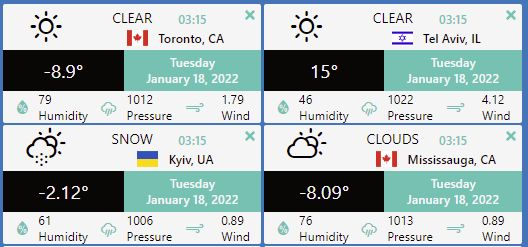

### Weather Web Application
#### Fully functional weather app with React,Typescript, Styled Components. Functionality includes the ability to show weather cards for different cities, add and remove city cards, sort the cards by drag and drop.

### Key Words
#### React: useState, useEffect, useReduce, useContext, useRef
#### npm: use-immer, react-dnd, react-dnd-html5-backend, react-flag-icon-css, nanoid
#### Custom Hooks: useFocus, useAppState, useGetWeather, useImmerReducer, useItemDrag, 
#### useDrop, useDebounce
#### Typescript: fetch, async, await, try, catch, destructuring, spread operator, rest operator, slice, date.toLocaleDateString
#### API: Open Weather Api
#### Icons: Weather icons, React icons, react-flag-icon-css
#### Styled-components: react component, props
#### CSS: flex, css grid, fluent typography, clamp, rem, vw, vh
#### Installation from zero:
```jsx
npx create-react-app project1
cd project1
yarn add use-immer
yarn add nanoid
yarn add react-dnd@14.0.1 react-dnd-html5-backend@14.0.0
yarn add react-icons
yarn add react-flag-icon-css
yarn start

"react-dnd": "14.0.1",
"react-dnd-html5-backend": "^16.0.1",
yarn add react-dnd-html5-backend
yarn add react-dnd-html5-backend@16.0.1
export type CardDragItem = {
  id: string;
  text: string;
  type: "CARD";
};

export type DragItem = CardDragItem;
       <Formik<TaskSettings>
              initialValues={entity}
              enableReinitialize={true}
              validationSchema={taskSettingsValidationSchema}
              onSubmit={handleSubmit}
        >
```
### Links:
https://styled-components.com/
https://react-icons.github.io/react-icons/
https://github.com/erikflowers/weather-icons
https://openweathermap.org/api
https://www.npmjs.com/package/use-immer
https://react-dnd.github.io/react-dnd/about
### Immer
useImmer(initialState) is very similar to useState. When passing a function to the updater, the draft argument can be mutated freely, until the producer ends and the changes will be made immutable and become the next state.

### React DnD
React DnD is a set of React utilities to help you build complex drag and drop interfaces while keeping your components decoupled.

### Task: <span style="color:blue"> Setup Less with create-react-app boilerplate, add Ant Design React UI library, get default variables from ant-design default.less file.</span>

add to **package.json**

### `npm start`

Runs the app in the development mode.\
Open [http://localhost:3000](http://localhost:3000) to view it in the browser.

The page will reload if you make edits.\
You will also see any lint errors in the console.

### `npm test`

Launches the test runner in the interactive watch mode.\
See the section about [running tests](https://facebook.github.io/create-react-app/docs/running-tests) for more information.

### `npm run build`

Builds the app for production to the `build` folder.\
It correctly bundles React in production mode and optimizes the build for the best performance.

The build is minified and the filenames include the hashes.\
Your app is ready to be deployed!

See the section about [deployment](https://facebook.github.io/create-react-app/docs/deployment) for more information.

## Learn More

You can learn more in the [Create React App documentation](https://facebook.github.io/create-react-app/docs/getting-started).

To learn React, check out the [React documentation](https://reactjs.org/).
